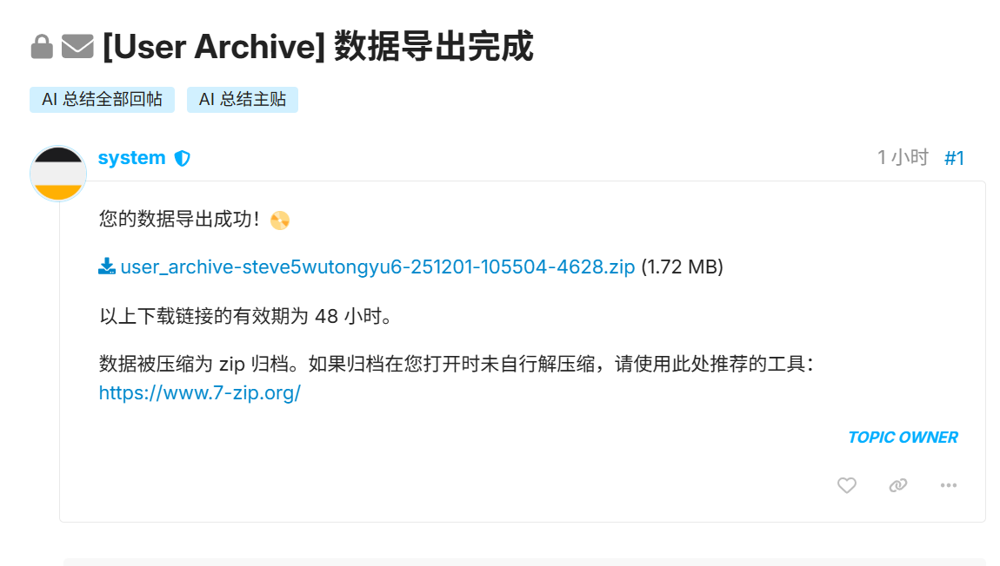
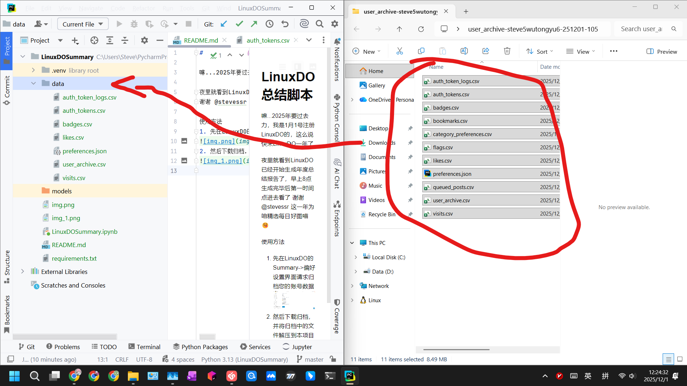
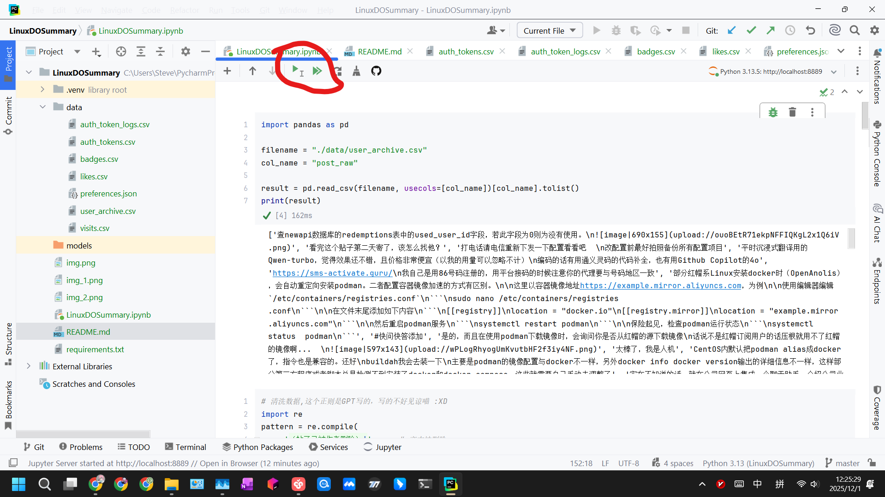

# LinuxDO 总结脚本

嘛...2025年要过去力，我是1月1号注册LinuxDO的，这么说快来LinuxDO一年了

夜里就看到LinuxDO已经开始生成年度总结报告了，早上8点生成完毕后第一时间点进去看了
谢谢 @stevessr 这一年为咱精选每日好图喵 😋

使用方法
1. 先在LinuxDO的Summary->偏好设置界面请求归档您的账号数据

2. 然后下载归档，并将归档中的文件解压到本项目的data目录下

3. 在JupyterNotebook/Pycharm中运行本脚本
